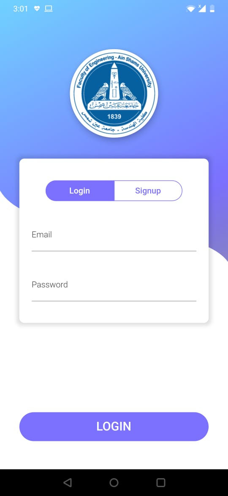
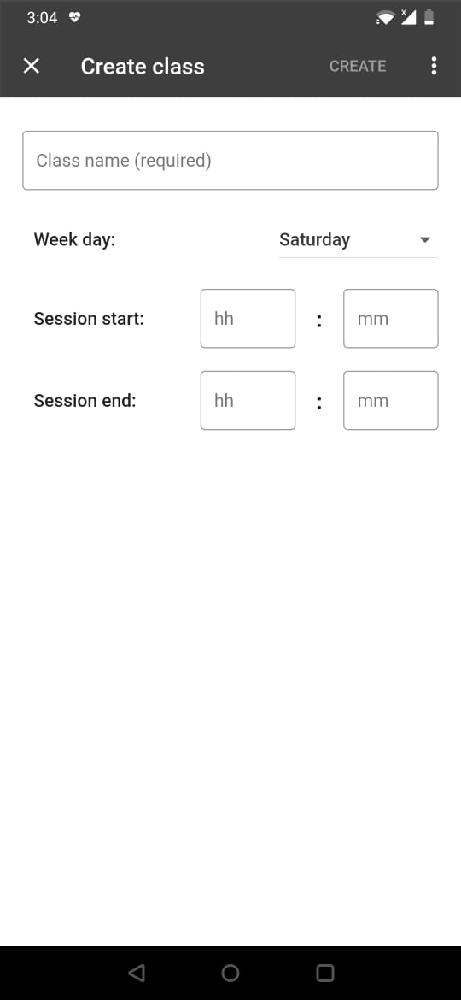
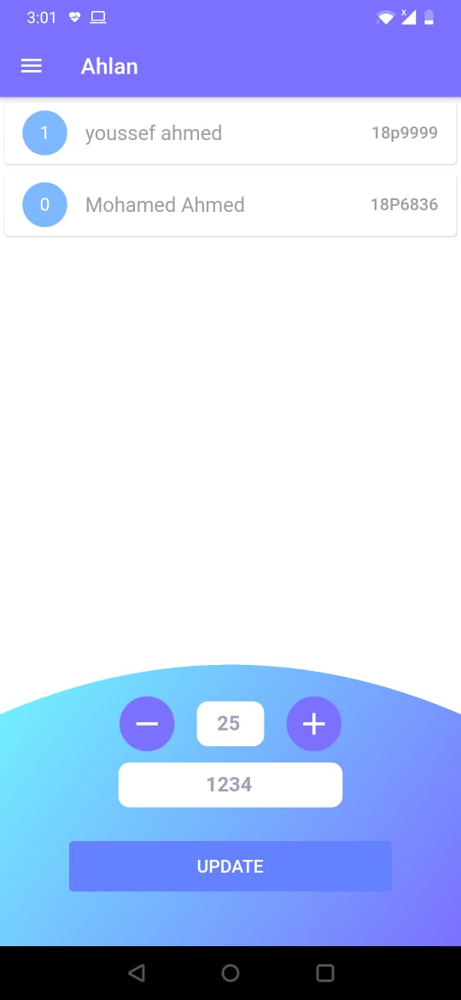
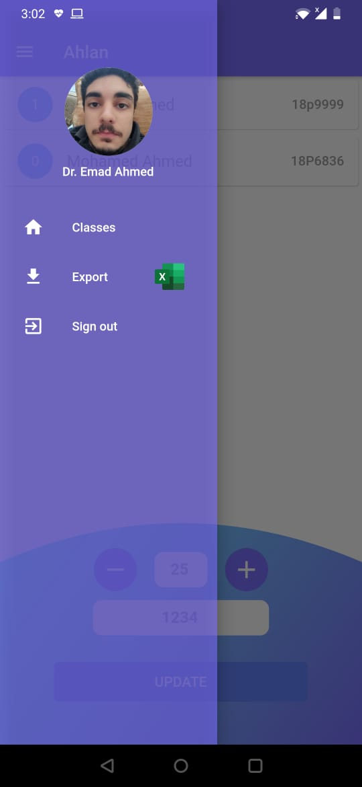
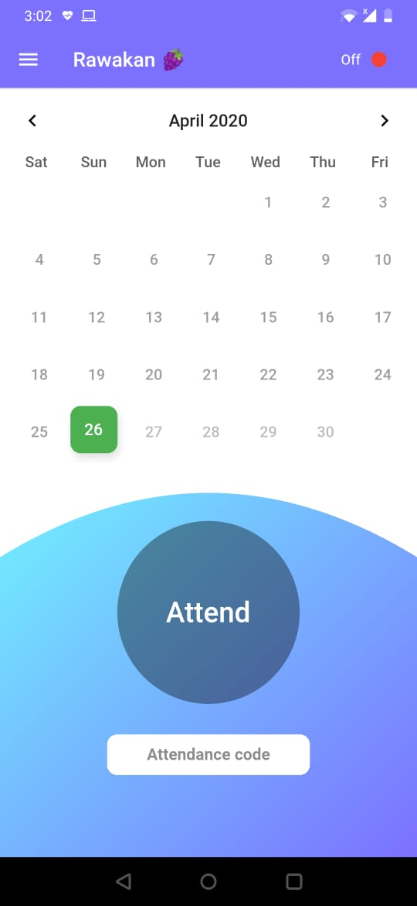

# Attend
 Smart, easy, and reliable attendance app for instructors and students.

### Features
- Register as a student or an instructor.
- Instructor creates classrooms with assigned codes to join via students.
- Instructor downloads a formatted excel sheet for the attendance at any time.
- Student joins classrooms by their codes and views all his classrooms.
- Student visualizes the classes he missed or attended on a calender.

### Screenshots

<table>
  <tr>
    <td> </td>
    <td> </td>
    <td> </td>
 </tr>
 <tr>
    <td> </td>
    <td> </td>
    <td> </td>
  </tr>
</table>
